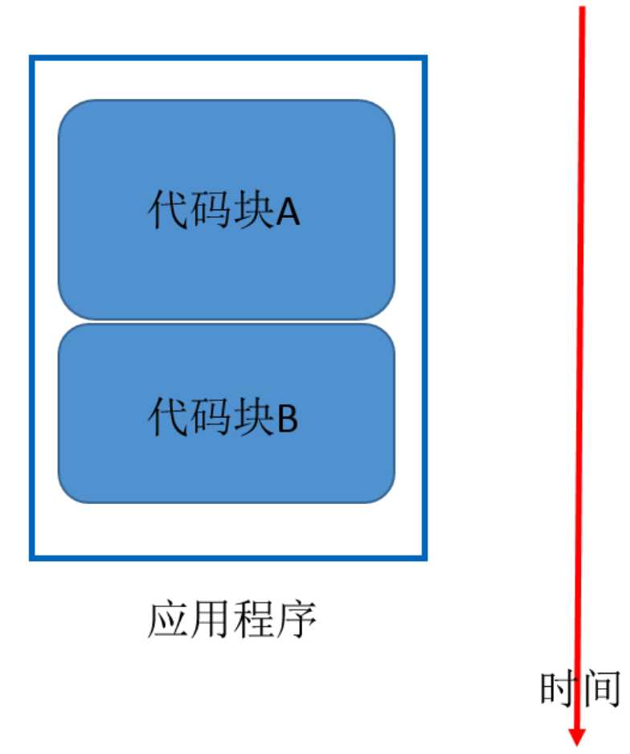
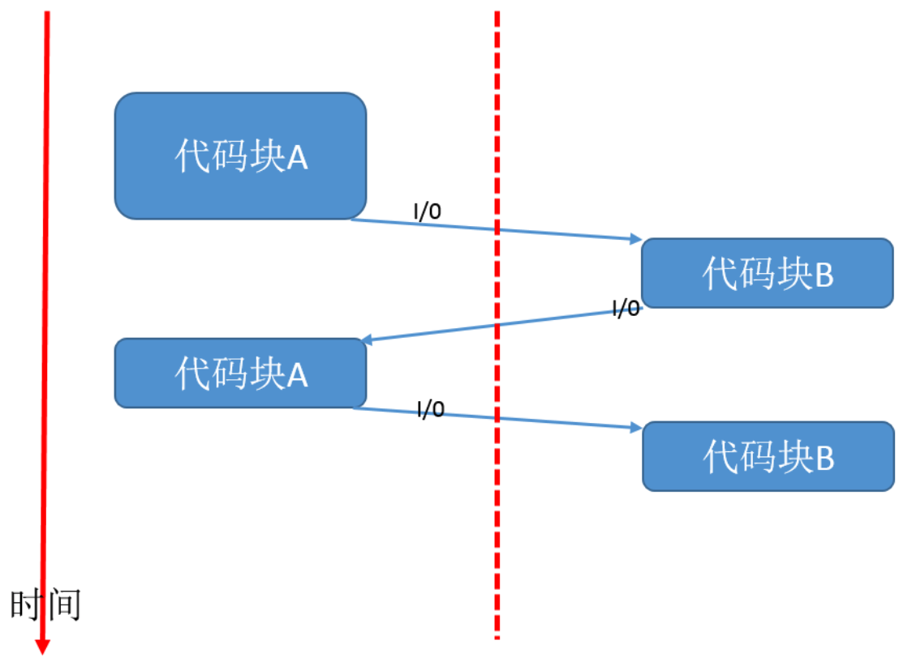

## 协程的基本概念
[参考](https://www.cnblogs.com/zingp/p/8678109.html) 

> 我们知道线程的调度（线程上下文切换）是由操作系统决定的，当一个线程启动后，什么时候占用CPU、什么时候让出CPU，程序员都无法干涉。假设现在启动4个线程，CPU线程时间片为 5 毫秒，也就是说，每个线程每隔5ms就让出CPU，让其他线程抢占CPU。可想而知，等4个线程运行结束，要进行多少次切换？

> 如果我们能够自行调度自己写的程序，让一些代码块遇到IO操作时，切换去执行另外一些需要CPU操作的代码块，是不是节约了很多无畏的上下文切换呢？是的，协程就是针对这一情况而生的。我们把写好的一个应用程序分为很多个代码块，如下图所示：

> 顺序执行

> 协程执行

> 关于协程可以总结以下两点：
>>（1）线程的调度是由操作系统负责，协程调度是程序自行负责。
>>（2）与线程相比，协程减少了无畏的操作系统切换。
>> (3)实际上当遇到IO操作时做切换才更有意义，（因为IO操作不用占用CPU），如果没遇到IO操作，按照时间片切换，无意义。

### 1. 基于yield实现协程
> (1) 在函数中，语句执行到yield，会返回yield 后面的内容；当再回来执行时，从yield的下一句开始执行；

> (2) 使用yield语法的函数是一个生成器；

> (3) python3中，通过 .__next__() 或者 next() 方法获取生成器的下一个值。

> (4) [code](1_基于yield实现协程.py)

### 2. 基于yield实现actor 
> (1) actor模式是一种最古老的也是最简单的并行和分布式计算解决方案。下面我们通过yield来实现：

> (2) [code](2_基于yield实现actor模型.py)

>> (1) ActorScheduler 负责事件循环

>> (2) counter() 负责控制终止

>> (3) task1 / task2 相当于切换的协程，当程序运行到这些函数内部的yield处，就开始切换。

### 3. 
[actor](https://cloud.tencent.com/developer/news/698662)
[actor](https://www.jianshu.com/p/d803e2a7de8e)