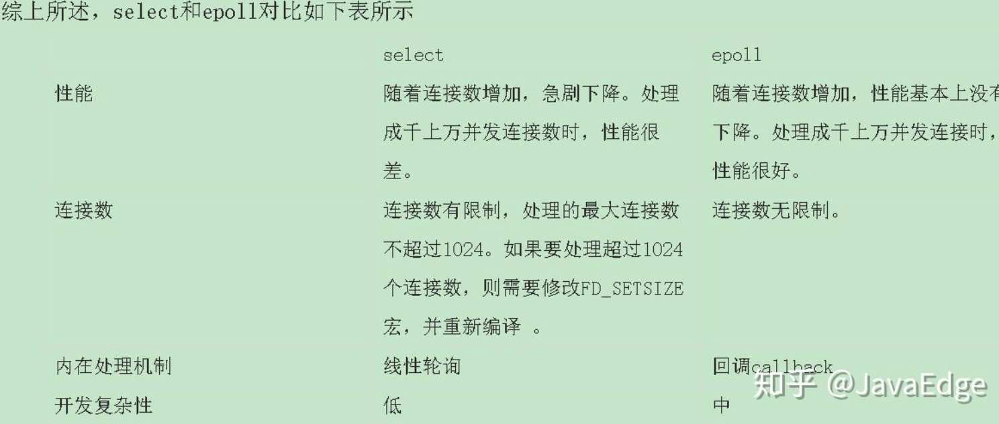

#### IO多路复用是IO模式的一种,是一种单线程处理多并发的IO操作的方案,其他IO操作方案分别有 :

> 阻塞 I/O（blocking IO）  
> 非阻塞 I/O（nonblocking IO）  
> I/O 多路复用（ IO multiplexing）  
> 异步 I/O（asynchronous IO）

IO多路复用其实就是我们说的select，poll，epoll,它的基本原理就是select，poll，epoll这个function会不断的轮询所负责的所有socket，当某个socket有数据到达了，就通知用户进程。

### select poll 和 epoll 的区别
> 1 select 基于轮训机制
>> a. select本质上是通过设置或检查存放fd标志位的数据结构进行下一步处理。 这带来缺点： - 单个进程可监视的fd数量被限制，即能监听端口的数量有限 单个进程所能打开的最大连接数有FD_SETSIZE宏定义，其大小是32个整数的大小（在32位的机器上，大小就是3232，同理64位机器上FD_SETSIZE为3264），当然我们可以对进行修改，然后重新编译内核，但是性能可能会受到影响，这需要进一步的测试 一般该数和系统内存关系很大，具体数目可以cat /proc/sys/fs/file-max察看。32位机默认1024个，64位默认2048> 2. epoll基于操作系统支持的I/O通知机制 epoll支持水平触发和边沿触发两种模式。  
>> b. 对socket是线性扫描，即轮询，效率较低： 仅知道有I/O事件发生，却不知是哪几个流，只会无差异轮询所有流，找出能读数据或写数据的流进行操作。同时处理的流越多，无差别轮询时间越长 - O(n)。  
>> c. 当socket较多时，每次select都要通过遍历FD_SETSIZE个socket，不管是否活跃，这会浪费很多CPU时间。如果能给 socket 注册某个回调函数，当他们活跃时，自动完成相关操作，即可避免轮询，这就是epoll与kqueue。  

>> 缺点：
>>> a. 内核需要将消息传递到用户空间，都需要内核拷贝动作。需要维护一个用来存放大量fd的数据结构，使得用户空间和内核空间在传递该结构时复制开销大。  
>>> b. 每次调用select，都需要把fd集合从用户态拷贝到内核态，这个开销在fd很多时会很大    
>>> c. 同时每次调用select都需要在内核遍历传递进来的所有fd，这个开销在fd很多时也很大  
>>> d. select支持的文件描述符数量太小了，默认是1024  

> 2 poll 和select 类似
>> a. poll的实现和select非常相似，只是描述fd集合的方式不同，poll使用pollfd结构而不是select的fd_set结构，其他的都差不多,管理多个描述符也是进行轮询，根据描述符的状态进行处理，但是poll没有最大文件描述符数量的限制。poll和select同样存在一个缺点就是，包含大量文件描述符的数组被整体复制于用户态和内核的地址空间之间，而不论这些文件描述符是否就绪，它的开销随着文件描述符数量的增加而线性增大。  
>> b. 它将用户传入的数组拷贝到内核空间    
>> c. 然后查询每个fd对应的设备状态： 
>> d. 如果设备就绪 在设备等待队列中加入一项继续遍历    
>> e. 若遍历完所有fd后，都没发现就绪的设备 挂起当前进程，直到设备就绪或主动超时，被唤醒后它又再次遍历fd。这个过程经历多次无意义的遍历。    
>> f. 没有最大连接数限制，因其基于链表存储，其缺点： - 大量fd数组被整体复制于用户态和内核地址空间间，而不管是否有意义 - 如果报告了fd后，没有被处理，那么下次poll时会再次报告该fd

> 3 epoll 又称为 event poll : 触发模式
>> epoll会把哪个流发生哪种I/O事件通知我们。所以epoll是事件驱动（每个事件关联fd）的，此时我们对这些流的操作都是有意义的。复杂度也降低到了O(1)。  
>> 表面上看epoll的性能最好，但是在连接数少并且连接都十分活跃的情况下，select和poll的性能可能比epoll好，毕竟epoll的通知机制需要很多函数回调。

  
[参考](https://zhuanlan.zhihu.com/p/272891398)

### select python 编程
[参考](https://www.jianshu.com/p/818f27379a5e)

### epoll python 编程
[参考](https://harveyqing.gitbooks.io/python-read-and-write/content/python_advance/how_to_use_linux_epoll.html)
[参考](https://www.cnblogs.com/huchong/p/8613308.html)

